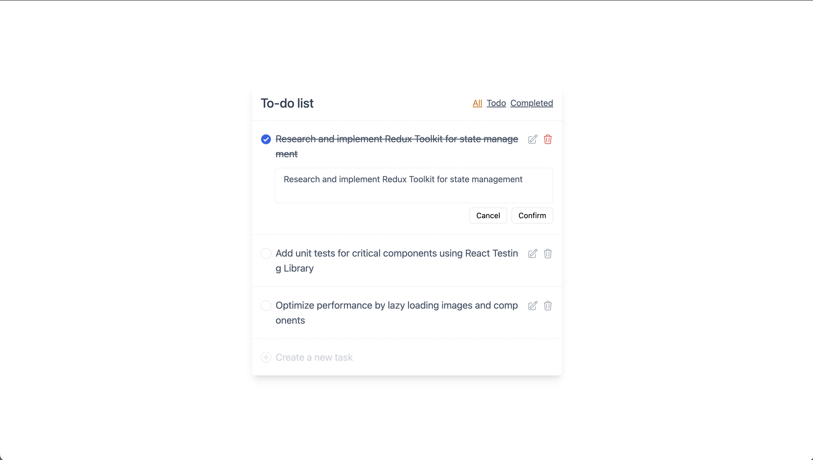

# React Todo
<p>
  
  
  
  
</p>

**React Todo** is a responsive, user-friendly application for managing daily tasks, created to practice and reinforce skills with Redux Toolkit in a real-world context. Users can add, edit, delete, and filter tasks to organize their to-do list effectively. The app also includes a keyboard navigation feature, enhancing accessibility and ease of use. All tasks are stored in local storage, so the list persists even after a page refresh.


You can view the live demo of the project at: [React Todo](https://vanyalyashuk.github.io/react-todo/)



### Key Features:
- **Add, Edit, and Delete Todos**: Seamlessly manage your tasks with options to update or remove them as needed.
- **Filter by Completion Status**: View all tasks or filter by those that are completed or active. 
- **Keyboard Navigation**: Easily navigate through tasks using keyboard shortcuts.
- **Persistent Storage**: Tasks are saved in local storage, ensuring they remain after a page reload.
- **Redux Toolkit State Management**: Utilized for structured and efficient state handling.

## Installation

To run the project locally, follow these steps:

1. **Clone the repository**:
   ```bash
   git clone https://github.com/VanyaLyashuk/react-todo.git
   cd react-todo

2. **Install dependencies and Netlify CLI**:	
	```bash
	npm install
2. **Start the application**  using Netlify:	
	```bash
	npm run dev

## License

This project is licensed under the MIT License. See the [LICENSE](https://opensource.org/licenses/MIT) file for more information.
